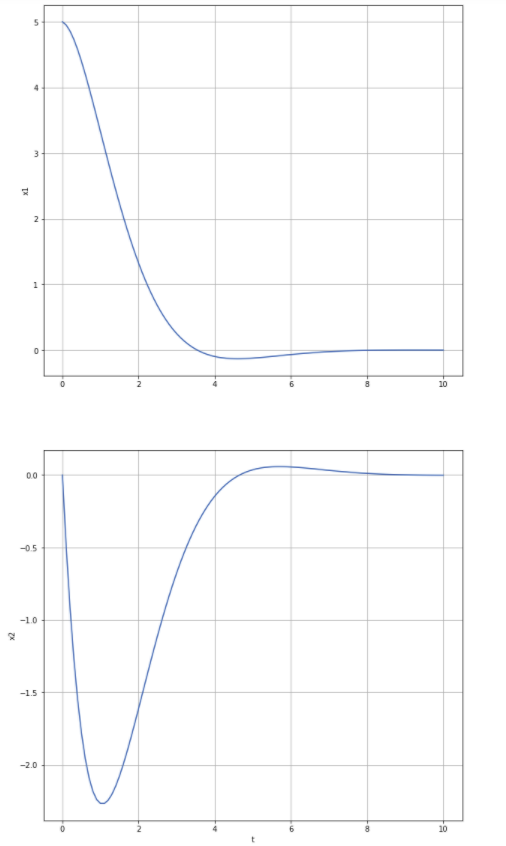

# data_driven_PE_predictive_control
persistently exciting based predictive control

1. Paper 1 DeePC: Data-Enabled Predictive Control (ref: In the Shallows of the DeePC)

   1. Example: Mass spring system with full observation

      

2. Paper 2 Data-driven MPC with equality terminal constraints (ref: Data-Driven Tracking MPC for Changing Setpoints)

   1. Example 1: mass spring system

      1. Full observation

         

      2. Partial observation

         

   2. Example 2: four tank system

      1. The simulation for the case study included in their paper not stable. My simulation is designed for a nominal system (no noise no disturbance); therefore, a nominal predictive control with terminal equality constraints applied. Should I use the robust version to acquire stability? -> next: either find why it is not stable or implement the robust version to see what is gonna happen. Explanation: since the set point in the paper is not an equilibrium point, slack variable ($\lambda_{\sigma}$) for $y$ is need. $\lambda_{\alpha}$ is also needed for a stable controller.

      2. After adding the regularization term $\lambda_{\alpha}$ ($\lambda_{\alpha} \bar{\varepsilon} = 0.1$), the closed-loop is stable. However, constant tracking error exists. 

         

      3. Potential remedy: full observation, set equilibrium point as the set point `ry = [0.64440373,0.75261324,0.80263158,1.14285714], ru = [1,1]), lambda_alpha*epsilon = 1.2, n = 1, L = 30, T = 400`

         (**But sometimes still not stable**)

         

3. Paper 3 Data-driven MPC with terminal cost and terminal constraints (ref: On the design of terminal ingredients for data-driven MPC)

4. Paper 4 Stable, optimal, robust data-driven control: Formulas for Data-Driven Control (ref: Stabilization, Optimality, and Robustness)

   1. Stable feedback gain

      
